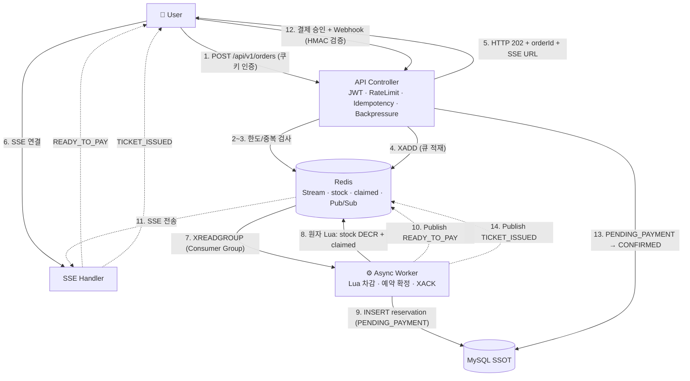

# SnapTix

> 공정하고 안전한 **선착순 티켓팅 플랫폼**

SnapTix는 콘서트·공연처럼 **짧은 시간에 요청이 폭증하는 선착순 티켓팅** 상황에서, 시스템이 죽지 않고 **재고를 정확히(오버셀 0건) · 주문을 유실 없이 · 장애에서 스스로 복구**하며 처리하는 것을 목표로 하는 백엔드 프로젝트입니다.

> 개발 환경·도구 설정(ktlint · detekt · Kover · 모니터링 · k6 실행)은 [README-setting.md](./README-setting.md)를 참고하세요.

---

## 🎯 무엇을 푸는 프로젝트인가

티켓팅의 진짜 어려움은 "기능"이 아니라 **동시성**입니다. 수천 명이 같은 좌석을 동시에 노릴 때 흔히 생기는 문제:

- **오버셀** — 100석인데 101명에게 팔림 (동시 차감 경합)
- **주문 유실** — 트래픽 폭주로 요청이 조용히 사라짐
- **중복 구매** — 한 사람이 여러 장을 채감
- **장애 전파** — Redis 하나 흔들리면 전체가 무너짐

SnapTix는 이 4가지를 **아키텍처 차원에서** 막는 데 집중합니다.

| 목표 | 접근 |
| --- | --- |
| 과부하 시 정합성 | 요청을 DB에 직접 넣지 않고 **Redis Stream 큐**로 흘려보내고, 워커가 **원자적 Lua 스크립트**로 재고를 차감 |
| 주문 유실 방지 | **Consumer Group + PEL + XACK + XAUTOCLAIM**으로 처리 확인이 끝난 주문만 큐에서 제거 |
| 1인 1매 | MySQL **활성 유니크 제약**(생성 컬럼 + UNIQUE)으로 DB 레벨 보장 |
| 장애 복구 | **서킷 브레이커**로 Redis 장애를 격리하고, 복구 시 **MySQL(SSOT) 기반으로 재고를 재구축** |

---

## ✨ 핵심 기능

- **주문 인게스트 & 백프레셔** — "구매하기"를 누르면 서버는 DB를 건드리지 않고 즉시 `202`로 응답하고, 요청을 대기열(Redis Stream)에 적재합니다. 큐가 정원+α를 넘으면 `429`로 흘려보내 시스템을 보호합니다.
- **백그라운드 워커 처리** — Consumer Group 워커가 큐를 소비하며, 원자 Lua로 재고를 차감하고 예약을 확정합니다. 실패하는 모든 경로에서 **통일 보상 불변식**(재고 +1 회수)을 공통 적용해 누수를 막습니다.
- **실시간 알림(SSE)** — 주문 결과(`READY_TO_PAY` / `TICKET_ISSUED` / `ORDER_FAILED` 등)를 Redis Pub/Sub 기반 SSE로 실시간 전송합니다. 연결이 끊겼다 재연결되면 `Last-Event-ID`가 아니라 **서버가 DB 상태를 기준으로 재구성**해 재전송하며, 같은 연결이 결제 완료까지 유지됩니다.
- **결제 타임아웃 & 좌석 반납** — 홀드(5분) 내 미결제 시 좌석을 자동 반납(Mock PG 연동)합니다. 결제는 승인(`approve`) + Webhook(HMAC-SHA256 서명 검증)으로 `PENDING_PAYMENT → CONFIRMED` 전이가 일어납니다.
- **인증/인가** — JWT(httpOnly 쿠키) 기반 회원가입·로그인, RBAC(`ADMIN` / `USER` / `STAFF`).
- **이벤트 조회** — Redis Cache-Aside(TTL 1h) + 실시간 재고 노출.
- **장애 감지 & 자동 복구** — Resilience4j 서킷 브레이커, 복구 후 일관 스냅샷으로 상태 재구축, Reconcile·Drift 정산 배치.
- **관측성 & 알림** — Prometheus + Grafana 메트릭 시각화, Slack Webhook 알림.

---

## 🧱 기술 스택

| 구분 | 사용 기술 |
| --- | --- |
| 언어 / 런타임 | Kotlin, JVM |
| 프레임워크 | Spring Boot, Spring Security, Resilience4j (서킷 브레이커) |
| 데이터 (SSOT) | MySQL |
| 인메모리 / 큐 | Redis (Streams · Pub/Sub · AOF 영속화) |
| 인증 | JWT (httpOnly 쿠키), RBAC |
| 관측성 | Micrometer · Prometheus · Grafana · Slack Webhook |
| 부하 테스트 | k6 (xk6-sse 포함) |
| 테스트 | JUnit · MockK · Testcontainers · ArchUnit · Kover |
| 품질 | ktlint · detekt · GitHub Actions (CI) |
| 인프라 | Docker Compose · AWS · Nginx Proxy Manager |

---

## 🏗️ 아키텍처 한눈에 보기

### 주문 접수 → 결제 → 발권 흐름



핵심은 **API는 절대 DB에 직접 쓰지 않는다**는 것입니다. 요청은 큐로만 들어가고, 실제 재고 차감·예약 생성은 워커가 순차·원자적으로 처리해 경합을 제거합니다.

### 장애 감지 → 자동 복구 흐름

Redis 접근은 모두 **서킷 브레이커**를 통과합니다. Redis가 흔들리면 회로가 `OPEN`되어 신규 주문을 `503`으로 즉시 차단(장애 격리)하고, Slack으로 알립니다. 복구가 감지되면(`HALF_OPEN → CLOSED`) **Rebuild 서비스**가 MySQL(단일 진실 소스)을 읽어 `stock = 정원 − (CONFIRMED + 유효 PENDING)` 공식으로 재고를 재구축합니다. 이때 만료 예약을 먼저 정리(Reconcile)한 뒤 재구축하며, 상시 **드리프트 정산**으로 오버셀을 잡아냅니다.

---

## 🔑 알아두면 좋은 도메인 개념

- **재고 키** — `ZONE:{zoneId}:stock`. 구역(Zone) 단위 총 수용 인원으로 재고를 관리합니다. (개별 좌석 X)
- **멱등성 키** — `idempotency:order:{userId}:{eventId}`. `SET NX`로 중복 주문을 `409`로 차단하고, compare-and-delete로 정리합니다.
- **유효 점유** — `PENDING_PAYMENT` 또는 `CONFIRMED`만 "좌석 점유"로 인정. `CANCELLED`·`RELEASED`는 점유에서 제외.
- **통일 보상 불변식** — 워커가 재고를 차감하고도 예약을 확정하지 못한 모든 종료 경로에서 `stock +1` 회수를 공통 적용.
- **SSE 이벤트** — `READY_TO_PAY` · `ORDER_FAILED` · `TICKET_ISSUED` · `PAYMENT_TIMEOUT` · `PAYMENT_FAILED`.
- **Redis 영속성** — PEL 보존을 위해 AOF(`appendonly yes`, `appendfsync everysec`) 활성화.

---

## 🧪 부하 테스트로 검증하는 것

k6 시나리오로 고동시성 상황의 정합성을 실측 검증합니다.

- **`order-load`** — 초당 20건 주문을 발생시키고, 접수(`202`) → `READY_TO_PAY` → **결제 승인 + Webhook → `CONFIRMED`** 까지 전체 결제 경로를 추적합니다. `oversell_errors = 0`, 백프레셔(`429`)·멱등 충돌(`409`)은 정상 응답으로 분류합니다.
- **`sse-reconnect`** — `xk6-sse`로 실제 SSE 이벤트 스트림을 수신하여, 초기 `READY_TO_PAY` 수신 → 의도적 재연결 시 **서버의 DB 기반 상태 재구성** → 같은 연결에서 `TICKET_ISSUED`까지 수신, 타인 주문 구독 시 소유권 `403`을 검증합니다.

실행 방법은 [README-setting.md](./README-setting.md)와 [`loadtest/README.md`](./loadtest/README.md)를 참고하세요.

---

## 🔧 엔지니어링 노트 — 부하 테스트로 드러난 이슈들

부하 테스트를 도입하면서 단위 테스트로는 잡히지 않던 실전 버그들을 발견·수정했습니다. 대표 사례:

- **시간대 불일치로 인한 예약 조기 만료** — DB(`reservations.created_at`)와 앱 시계가 9시간 어긋나, 생성 1분 된 예약을 홀드 만료로 오판해 재고를 즉시 반환하던 버그. JDBC `connectionTimeZone=SERVER`로 드라이버가 매 연결마다 서버 세션 시간대를 직접 질의하도록 수정(실행 환경 무관하게 정확). 회귀 테스트로 고정. (#365)
- **SSE 비동기 재디스패치 시 인증 컨텍스트 소실** — `SseEmitter`의 ASYNC 재디스패치에서 JWT 필터가 스킵되어 `SecurityContext`가 비고 `AuthorizationDeniedException`이 발생. `shouldNotFilterAsyncDispatch() = false` 오버라이드 한 줄로 해결(STATELESS 정책상 인증 복원 경로가 이 필터뿐). (#373)
- **SSE Redis 구독 컨테이너 race** — 채널 수가 순간 0으로 떨어지는 전이에서 `RedisMessageListenerContainer`가 Subscription을 종료·재생성하다 `RedisInvalidSubscriptionException`이 신규 구독을 크래시. 앱 기동 시 keepalive 채널을 고정 구독해 활성 채널 수가 0이 되는 순간 자체를 제거. (#376)
- **SSE 엔드포인트 컨텐츠 협상 실패** — `produces=text/event-stream` 컨트롤러에서 `BusinessException`이 JSON 핸들러로 전파되며 `HttpMediaTypeNotAcceptable`로 붕괴(소유권 위반 시 403이 전달 안 됨). 컨트롤러 로컬 예외 처리로 상태코드/바디를 직접 써서 협상을 우회. (#377)

이 사례들은 "동시성·비동기·실환경 설정"에서 문제가 어떻게 드러나고 어떻게 좁혀 수정하는지를 보여줍니다.

---

## 🚀 빠르게 실행해보기

> 자세한 사전 조건과 옵션은 [README-setting.md](./README-setting.md)를 참고하세요.

```bash
# 1. 의존성(MySQL · Redis) 컨테이너 기동
docker-compose up -d

# 2. 애플리케이션 실행
./gradlew bootRun

# 3. (선택) 모니터링 스택 기동
cd monitoring && docker compose -f docker-compose.monitoring.yml up -d
```

- API 기본 포트: `:8080`
- Grafana 대시보드: `http://localhost:3000` (`SnapTix > SnapTix Resilience`)
- 부하 테스트: `./loadtest/run.sh order-load` ([loadtest/README.md](./loadtest/README.md))

---

## 📚 더 읽을거리

| 문서 | 내용 |
| --- | --- |
| [README-setting.md](./README-setting.md) | 코드 품질 도구 · 모니터링 · 부하 테스트 실행 설정 |
| [COVERAGE.md](./COVERAGE.md) | 패키지별 테스트 커버리지 현황 |
| [loadtest/README.md](./loadtest/README.md) | k6 부하 테스트 상세 가이드 |

---

## 🗺️ 프로젝트 성격

부트캠프 최종 프로젝트로 진행된 SnapTix의 MVP는 **NORMAL 모드 단일화 · 결제 Mocking**을 전제로, "고동시성 상황에서의 **정합성 · 무손실 · 장애 복구**"라는 세 가지 핵심 목표 검증에 집중합니다. 인프라 비용 제약(월 8만원 이하) 안에서, 추가 컴포넌트 없이 기존 Redis의 내장 자료구조(Streams)만으로 문제를 푸는 것을 설계 원칙으로 삼았습니다.
